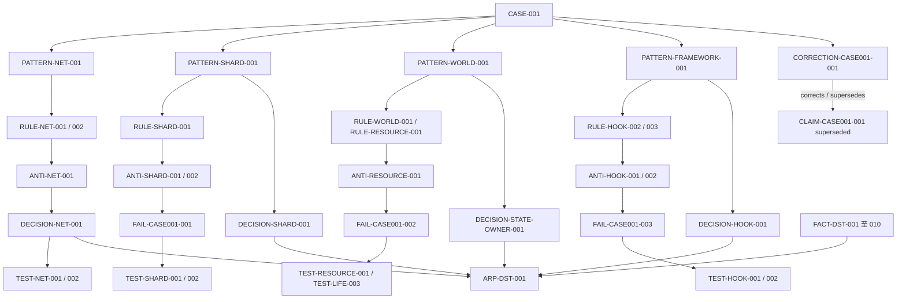
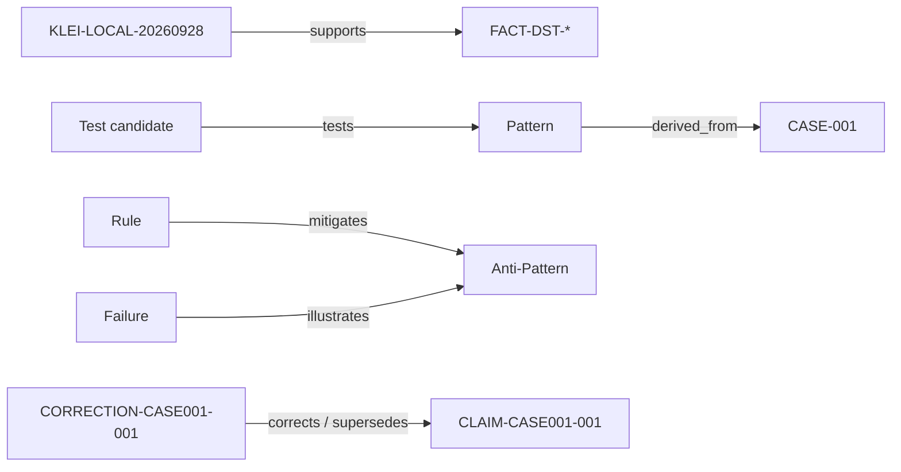

# 知识关系图 v0.1.1

这些箭头表示检索/关联方向，不表示“下一个条目证明上一个条目为真”。完整机器边在 `data/relations.json`。

## 最小检索包

| 入口 | 必须一起读取 |
|---|---|
| Player Business Channel | Host/Remote规则、生命周期反模式、NET决策、NET测试候选 |
| Shard Service Bus | Authority规则、两种可写副本反模式、静态种子失败、离线恢复测试 |
| World Manager | Registry与真实状态边界、资源Provider交集、所有者决策、实体移除测试 |
| Framework | Hook作用域/ownership、异常恢复失败、Hook决策、双Mod包装测试、Correction |

机器图采用九种 typed relation；已有 related 边保持不变。下图是部分明确关系的方向，其他检索关联不自动变成证明：

tests 只表示测试目标，未执行；illustrates 不表示实机复现；derived_from 单一 Case 不意味着普适。Source、Claim 和知识条目采用分离节点集合。Agent 应继续读取 Case Evidence / Counter Evidence / Does Not Mean，并把 Correction 和历史 Claim 一起检索。
